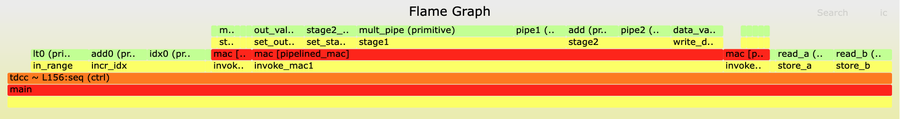
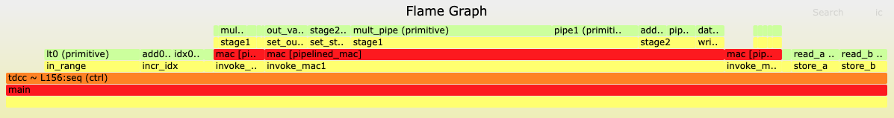

# Petal (Calyx Profiler) Evaluation

This repository contains the evaluation materials for our OOPSLA 2026 paper, "Understanding Accelerator Compilers via Performance Profiling".

The evaluation consists of reproduction of figures and performance claims made in the paper, which introduces Petal, a profiler for The Calyx Infrastructure.

**Goals:** There are three goals for this artifact evaluation:
1. To reproduce the flame graphs, timeline views, and statistics tables generated by Petal in case studies.
2. To reproduce claims about Petal's performance.
3. To show Petal's robustness.

# Download & Installation

The artifact is available in a Virtual Machine packaged as an OVA file, of which a permanent link is available [here](). We assume that you are using [VirtualBox](https://www.virtualbox.org/). We also include instructions for building the virtual machine using Vagrant in the `vm` directory.

**The username is `vagrant`, and the password is `vagrant`.**

**NOTE:** An internet connection is necessary for Vivado installation and for opening Perfetto UI to view timeline views.

### Setting up Vivado (Requires ~59GB; Estimated time: 1.5-4 hours)

Our evaluation uses Xilinx's Vivado to generate area and timing estimates. Unfortunately because of licensing restrictions, we cannot distribute the VM with these tools installed. However, the tools are free, so we listed the instructions on downloading them below. Additionally, the web installer for the version of Vivado used in the paper (2020.2) is no longer supported, so we have included instructions for downloading Vivado 2022.2 instead. Therefore, some numbers in the artifact will differ from those in the paper.

0. If you don't have a [Xilinx account](https://www.xilinx.com/registration/create-account.html), create one.
1. Log into the VM (username: `vagrant`, password: `vagrant`).
2. The desktop should contain a file `Xilinx Installer`. Double click this to launch the installer; you may need to click "Make Executable").
3. Ignore the pop-up asking you for a new version by clicking `Continue`.
4. Log in with your Xilinx credentials. Make sure that the "Download and Install now" button is checked.
5. On "Select Product to Install", click "Vivado". Click next.
6. On "Select Edition to Install", click "Vivado ML Standard". Click next.
7. To minimize the amount of necessary disk space, only check the necessary devices/features for our evaluation. The sideways blue key icons next to each box will expand when you click on them. It should say "Disk Space Required: 58.2 GB" on the bottom after checking/unchecking as follows.
   - **Should be checked**:
      - "Design Tools" > "Vivado Design Suite" > "Vivado"
      - "Design Tools" > "Vivado Design Suite" > "Vitis HLS"
      - "Devices" > "Production Devices" > "SoCs" > **"Zynq UltraScale+ MPSoC (limited support)"**
   - **Should be UNchecked**:
      - "Design Tools" > "Vitis Model Composer(Xilinx Toolbox...)"
      - "Design Tools" > "DocNav"
      - "Devices" > "Install Devices for Kria SOMs and Starter Kits"
      - "Devices" > "Production Devices" > "SoCs" > "Zynq-7000 (limited support)"
      - "Devices" > "Production Devices" > "SoCs" > "Zynq UltraScale+ RFSoC (limited support)" (This should be greyed out)
      - "Devices" > "Production Devices" > "7 Series (limited support)" (Unchecking this will uncheck everything within it, which is what we want)
      - "Devices" > "Production Devices" > "UltraScale (limited support)" (Unchecking this will uncheck everything within it)
      - "Devices" > "Production Devices" > "UltraScale+ (limited support)" (Unchecking this will uncheck everything within it)
8. Agree to the licenses, and click Next.
9. **Change the install directory location to `/home/vagrant/Xilinx`**. After clicking Next, you should be asked whether you want to create this directory; click "yes".
10. Click "Install". Installation took us 1.5 hours, but it can take anywhere from 2-4 hours. The machine may periodically go into sleep, so it's important to watch over it.

<details>
<summary>**Troubleshooting common VM problems:**</summary>

- If you run out of disk space while installing Vivado tools, you will need to clear space on the host machine. The VM is configured to use a dynamically sized disk.

- When trying to run `vivado -version` after installation, you get the error message `application-specific initialization failed: couldn't load file "librdi_commontasks.so": libtinfo.so.5: cannot open shared object file: No such file or directory`. Try running
```
sudo apt update
sudo apt install libtinfo-dev
sudo ln -s /lib/x86_64-linux-gnu/libtinfo.so.6 /lib/x86_64-linux-gnu/libtinfo.so.5
```
</details>

### Setup instructions once you are in the VM and Vivado is installed.

This should be run at the beginning of every terminal session.

1. Activate the Python virtual environment:
```
eval $( fud2 env activate )
```

2. If you have logged out since the last time you've run it, re-run the Vivado set-up script:

```
source /home/vagrant/Xilinx/Vitis_HLS/2022.2/settings64.sh
```

Double check that you can now run Vivado by running `vivado -version`. The output should be:

```
vagrant@vagrant:~$ source /home/vagrant/Xilinx/Vitis_HLS/2022.2/settings64.sh
vagrant@vagrant:~$ vivado -version
Vivado v2022.2 (64-bit)
SW Build 3671981 on Fri Oct 14 04:59:54 MDT 2022
IP Build 3669848 on Fri Oct 14 08:30:02 MDT 2022
Tool Version Limit: 2022.10
Copyright 1986-2022 Xilinx, Inc. All Rights Reserved.
```

3. Navigate to the evaluation directory by typing:
```
cd ~/Desktop/calyx-profiler-eval
```

# Kick the tires

We list instructions for testing basic functionality of Petal and Vivado during the Kick the Tires Phase.

### Petal's basic functionality (< 5 min)

(1) Run Petal. In the terminal:
```
cd ~/calyx
mkdir svgs petal-runs
fud2 tests/correctness/pipelined-mac.futil -o svgs/pipelined-mac.svg --through profiler -s sim.data=tests/correctness/pipelined-mac.futil.data --dir petal-runs/pipelined-mac
```

(2) View the flame graph(s). A flattened flame graph should be created in `svgs/pipelined-mac.svg`. It should look like the below:



A scaled flame graph should also be created in `petal-runs/pipelined-mac/profiler-out/scaled-flame.svg`:



(3) Check the timeline view, which should be in `petal-runs/pipelined-mac/profiler-out/timeline_trace.pftrace`. Navigate to [https://ui.perfetto.dev/](https://ui.perfetto.dev/) in the browser, and then click on `Open trace file` in the left navigation bar. When you open the file, Perfetto should look like this:

")

(NOTE: There may be a small discrepancy on what the main component is named; it could be `toplevel.main`, `TOP.toplevel.main`, or something similar. In this README we go with `toplevel.main`.)

Both `toplevel.main` and `toplevel.main.mac` are dropdowns, and clicking on them will reveal activity of groups/control within the component. Check that you can navigate the Perfetto view (Press `W` for zooming in, `A` for navigating left, `D` for navigating right, and `S` for zooming out).

### Vivado kick-the-tires (<5 min)

We will run commands to ensure that Vivado is properly set up.

(1) Obtain a JSON summary of Vivado's resource usage report.

```
cd ~/calyx
fud2 tests/correctness/pipelined-mac.futil --to json-report --through synth-verilog-to-util-json -o pipelined-mac-synth.json --dir vivado-runs/pipelined-mac
```

This will generate a `pipelined-mac-synth.json` file containing a summary of synthesis and post-place-and-route results.
```
vagrant@vagrant:~/calyx$ head pipelined-mac-synth.json
{
  "synth": {
    "summary": {
      "lut": 119,
      "dsp": 3,
      "brams": 0.0,
      "registers": 164,
      "carry8": 6,
      "f7_muxes": 0,
      "f8_muxes": 0,
```

The original reports that was parsed to generate the JSON file is located:
- Post-place-and-route resource usage reports: `vivado-runs/pipelined-mac/out/FutilBuild.runs/impl_1/main_utilization_placed.rpt`
- Post-place-and-route timing reports: `vivado-runs/pipelined-mac/out/FutilBuild.runs/impl_1/main_timing_summary_routed.rpt`
- Synthesis resource usage reports: `vivado-runs/pipelined-mac-synth/out/FutilBuild.runs/synth_1/main_utilization_synth.rpt`.

This evaluation is focused on the post-place-and-route results rather than the synthesis results.

(2) Confirm the post-place-and-route resource usage numbers:
```
(venv) vagrant@vagrant:~/calyx$ jq '.impl.summary' pipelined-mac-synth.json
{
  "lut": 119,
  "dsp": 3,
  "brams": 0.0,
  "registers": 164,
  "carry8": 6,
  "f7_muxes": 0,
  "f8_muxes": 0,
  "f9_muxes": 0
}
```

(3) Confirm that this program meets the "default" clock period of 7.0, and therefore meets a frequency of 143MHz. Here, the `meet_timing` field will be 1 to indicate that the program met the requested clock period, which is indicated in the `period` field (and its frequency is reflected in the `frequency` field).

```
(venv) vagrant@vagrant:~/calyx$ tail -5 pipelined-mac-synth.json
  "meet_timing": 1,
  "worst_slack": 4.221,
  "period": 7.0,
  "frequency": 142.857
}
```

# Step-by-step guide

- **Case study data creation**: Generate the figures found in the paper by running Petal.

- **Vivado Result reproduction**: Generate the synthesis results found in the paper.

- **Performance comparison**: Run experiments to reproduce Petal's performance (briefly described in Section 7).

- (Optional) **Profiling with Petal**: Obtain profiling figures from an example program and perform an optimization.

# Case Study Data Creation (Estimated time: TODO minutes)

Run the `run-case-studies.sh` script. This script runs Petal and Verilator in order to reproduce all resulting figures and cycle counts in the paper.

```
bash run-case-studies.sh
```

Logs will be written to the `case-studies/logs` directory, and the script will report if any run failed. On a new run of the script, results from previous files will be removed.

## Viewing Results

Results will be written to the `case-studies/results` directory. Each figure and table in the paper will have a counterpart file; for example, Figure 4's flame graph will be generated in `case-studies/results/fig-4.svg`. Note that colors in Petal's output could differ from colors used in the paper.

### Flame Graphs

Flame graphs are outputted as `*.svg` files. Use firefox to open a flame graph file.

ex)
```
firefox case-studies/results/fig-4.svg
```

### Timeline views

Timeline views are outputted as `*.pftrace` files that can be viewed in [Perfetto UI](https://ui.perfetto.dev/). Navigate to [https://ui.perfetto.dev/](https://ui.perfetto.dev/) in the firefox browser, and then click on `Open trace file` in the left navigation bar.

*Key notes for navigation*
- Each "milisecond" on the Perfetto view represents a cycle.
- Press `W` for zooming in, `A` for navigating left, `D` for navigating right, and `S` for zooming out.
- _Calyx timeline views_: There is a dropdown for each cell in the program. If the cell contains control groups, there will be another dropdown that contains all of the control groups,
- _Dahlia timeline views_: Each code block (`for`, `if`) will have a corresponding dropdown.

Many timeline view figures were based on a "zoomed-in" view. Here is a guide on how to get the picture represented in each figure:
- Figure 5: Open the `toplevel.main` dropdown and its `Control Groups` dropdown.
- Figure 9d: Open the `toplevel.main` dropdown.
- Figure 9e: Open the `main` dropdown and its `BL0005: for (let k: ubit<4> = 0..2)` dropdown.
- Figure 11a: Open the `toplevel.main` dropdown and navigate to cycle 14160. Figure 11a shows the contents of the `Control Register Updates` track and the `Thread 000` track between cycles 14160-14173 (inclusive), with simplified names:
  - `upd14` corresponds to `read_A_idx`
  - `let17` corresponds to `read_B_idx`
  - `let18` corresponds to `mult_A_B`
  - `upd15` corresponds to `write`
  - `let19` corresponds to `i_next`
- Figure 11c: Open the `toplevel.main` dropdown and navigate to cycle 8180. The view represented in the figure is in cycles 8180-8186 (inclusive). The name mapping is the same as above. Note that the paper simplified the detail where `let18` now takes 4 cycles; this is because the multiplication primitive was given the annotation that it _could_ take 4 cycles..
- Figure 12a: No navigation required.
- Figure 12b: No navigation required.
- Figure 13a: Open the `toplevel.main.forward_instance` dropdown and pin the tracks `Control Register Updates`, `Thread 017`, `Thread 018`, and `Thread 019`. Then, navigate to cycle 1999. The view represented in the figure features cycles 1999-2023 (inclusive).
  - `bb0_72`-`bb0_79` corresponds to `bb_1`-`bb_6`
  - `bb0_80`-`bb0_87` corresponds to `bb_7`-`bb_12`
  - `bb0_88`-`bb0_95` corresponds to `bb_13`-`bb_18`
- Figure 13b: Open the `toplevel.main.forward_instance` dropdown and pin the tracks `Control Register Updates`, `Thread 017`, `Thread 018`, and `Thread 019`. Then, navigate to cycle 1993. The view represented in the figure features cycles 1993-2009 (inclusive). The simplified names are the same as for Figure 13a.
- Figure 14b: Open the `toplevel.main.forward_instance` dropdown and pin the tracks `Control Register Updates`, `Thread 017`, `Thread 018`, and `Thread 019`. Then, navigate to cycle TODO.
- Figure 17a: No navigation required.
- Figure 17b: No navigation required.
- Figure 17c: No navigation required.
- Figure 18b: Open the `main` dropdown, the `BL0028: while(spills != 0)` dropdown, the `BL0030: for(let y: ubit<32> = 1..9)` dropdown, and the `BL0031: for(let x: ubit<32> = 1..9)` dropdown. Then, navigate to cycle 1047. The iteration represented in the figure is in cycles 1047-1068 (inclusive).
  - Note: You may observe that there are iterations of the inner for loop that contain an empty gap where no line is active. This empty gap occurs when the guard in the preceding `if` is `false`. Calyx's `static-promotion` compiler pass allocates four cycles for each `if` and its corresponding body, but since the guard did not pass there was no activity on that specific cycle.
- Figure 18c: Open the `main` dropdown, the `BL0028: while(spills != 0)` dropdown, the `BL0030: for(let y: ubit<32> = 1..9)` dropdown, and the `BL0031: for(let x: ubit<32> = 1..9)` dropdown. Then, navigate to cycle 993. The iteration represented in the figure is in cycles 993-1008 (inclusive).

### Tables

- Table 1: Open `table1.csv` and check the rows that indicate `bb0_72`-`bb0_79`. 
- Table 2: `table2.csv` should be the same as Table 2 in the paper.

# Vivado Results (Estimated time: ~ minutes)

To reproduce post-place-and-route results, we will run synthesis and implementation on Vivado for the original and (final) optimized versions of the program.

**NOTE:** There will be slight differences between the numbers generated through this evaluation and those in the paper. This is because the evaluation uses Vivado 2022.2, whereas the paper used Vivado 2020.2. This is because the web installer for Vivado 2020.2 is no longer supported. None of these discrepancies should largely affect the claims that we make in the paper.

### Queues (Section 10.2; Estimated time: ~10 min)

In the paper, we make the claim:
> We found that the two versions of the program had a similar critical path and can meet a frequency of 143 MHz, and area decreased, where the total number of LUTs went from 1,251 to 872.

We walk through steps to support this claim.

(1) Generate a JSON Vivado summary of the original program:

```
cd ~/Desktop/calyx-profiler-eval
fud2 case-studies/sec-10/queues-original.futil --to json-report --through synth-verilog-to-util-json -o synth-results/queues-original-synth.json --dir vivado-runs/queues-original
```

(2) Generate a JSON Vivado summary of the optimized program:

```
cd ~/Desktop/calyx-profiler-eval
fud2 case-studies/sec-10/queues-full-opt.futil --to json-report --through synth-verilog-to-util-json -o synth-results/queues-full-opt-synth.json --dir vivado-runs/queues-full-opt-synth
```

(3) Check that post-place-and-route ("impl"), the number of LUTs of the optimized program is _lower_ than the number of LUTs in the original program.

```
(venv) vagrant@vagrant:~/Desktop/calyx-profiler-eval$ jq '.impl.summary.lut' synth-results/queues-original-synth.json
1223
(venv) vagrant@vagrant:~/Desktop/calyx-profiler-eval$ jq '.impl.summary.lut' synth-results/queues-full-opt-synth.json
883
```

(4) Check that both programs meet the clock period of 7.0, and therefore can meet a frequency of 143 MHz.

```
(venv) vagrant@vagrant:~/Desktop/calyx-profiler-eval$ tail -5 synth-results/queues-original-synth.json
  "meet_timing": 1,
  "worst_slack": 2.755,
  "period": 7.0,
  "frequency": 142.857
}
(venv) vagrant@vagrant:~/Desktop/calyx-profiler-eval$ tail -5 synth-results/queues-full-opt-synth.json
  "meet_timing": 1,
  "worst_slack": 2.339,
  "period": 7.0,
  "frequency": 142.857
}
```

### Sandpile (Section 11; Estimated time: 20 min)

In the paper, we make the claim:
> As one may expect from the nature of this optimization, we found that the area increased: the total number of LUTs went from 780 to 982. We also found that while the maximum frequency decreased from 257.7MHz to 217.5MHz, the end-to-end latency improved from 176,679 nanoseconds to 154,370 nanoseconds. We conclude that our final design trades better end-to-end latency for a slightly worse area.

1. Identify the maximum frequency and end-to-end latency of the original program. (~10 minutes)

First, we will _attempt_ to meet a clock period of 3.88. The `xdc-files` directory contains configuration files for target clock frequencies.

```
cd ~/Desktop/calyx-profiler-eval
fud2 case-studies/sec-11/sandpile-original.fuse --to json-report --through synth-verilog-to-util-json -o synth-results/sandpile-original-3-88.json --dir vivado-runs/sandpile-original-3-88 -s synth-verilog.constraints=`pwd`/xdc-files/3-88.xdc
```

Then, we will find that place-and-route cannot meet that frequency by checking the `meet_timing` field (the output could also be null):
```
(venv) vagrant@vagrant:~/Desktop/calyx-profiler-eval$ jq '.meet_timing' synth-results/sandpile-original-3-88.json
0
```

Next, we will attempt to meet a clock period of 3.89.

```
fud2 case-studies/sec-11/sandpile-original.fuse --to json-report --through synth-verilog-to-util-json -o synth-results/sandpile-original-3-89.json --dir vivado-runs/sandpile-original-3-89 -s synth-verilog.constraints=`pwd`/xdc-files/3-89.xdc
```

Then, we will find that place-and-route can meet that frequency:
```
(venv) vagrant@vagrant:~/Desktop/calyx-profiler-eval$ jq '.meet_timing' synth-results/sandpile-original-3-89.json
1
```

We can double check the frequency of this clock period, and calculate the end-to-end latency:
```
(venv) vagrant@vagrant:~/Desktop/calyx-profiler-eval$ jq '.frequency' synth-results/sandpile-original-3-89.json
257.069
(venv) vagrant@vagrant:~/Desktop/calyx-profiler-eval$ echo "3.89 * 45536" | bc -l
177135.04
```

2. Identify the maximum frequency and end-to-end latency of the optimized program. (~10 minutes)

First, we will _attempt_ to meet a clock period of 4.63. The `xdc-files` directory contains configuration files for target clock frequencies.

```
cd ~/Desktop/calyx-profiler-eval
fud2 case-studies/sec-11/sandpile-optimized.fuse --to json-report --through synth-verilog-to-util-json -o synth-results/sandpile-optimized-4-63.json --dir vivado-runs/sandpile-optimized-4-63 -s synth-verilog.constraints=`pwd`/xdc-files/4-63.xdc
```

Then, we will find that place-and-route cannot meet that frequency by checking the `meet_timing` field  (the output could also be null):
```
(venv) vagrant@vagrant:~/Desktop/calyx-profiler-eval$ jq '.meet_timing' synth-results/sandpile-optimized-4-63.json
0
```

Next, we will attempt to meet a clock period of 4.64.

```
fud2 case-studies/sec-11/sandpile-optimized.fuse --to json-report --through synth-verilog-to-util-json -o synth-results/sandpile-optimized-4-64.json --dir vivado-runs/sandpile-optimized-4-64 -s synth-verilog.constraints=`pwd`/xdc-files/4-64.xdc
```

Then, we will find that place-and-route can meet that frequency:
```
(venv) vagrant@vagrant:~/Desktop/calyx-profiler-eval$ jq '.meet_timing' synth-results/sandpile-optimized-4-64.json
1
```

We can double check the frequency and calculate the end-to-end latency:
```
(venv) vagrant@vagrant:~/Desktop/calyx-profiler-eval$ jq '.frequency' synth-results/sandpile-optimized-4-64.json
215.517
(venv) vagrant@vagrant:~/Desktop/calyx-profiler-eval$ echo "4.64 * 33632" | bc -l
156052.48
```


3. Compare the resource usage numbers (<1 min)

Now, we can compare the number of LUTs from the reports with the maximum frequency for both programs:
```
(venv) vagrant@vagrant:~/Desktop/calyx-profiler-eval$ jq '.impl.summary.lut' synth-results/sandpile-original-3-89.json
779
(venv) vagrant@vagrant:~/Desktop/calyx-profiler-eval$ jq '.impl.summary.lut' synth-results/sandpile-optimized-4-64.json
991
```

# Performance comparison (Estimated time: TODO minutes)

Here, we will reproduce claims about the performance of Petal given in Section 7 under the paragraph "_Petal profiling performance_":
> Most programs had 204–306 profiling probes inserted, except the forward feeding neural network (FFNN) program described in Section 10.1 which had 3026 probes.
> RTL tracing during simulation adds slightly less than a 2× overhead (compared to running a non-RTL tracing simulation) in all five programs.
> Compared to RTL tracing the original program, RTL tracing the instrumented program adds a <10% overhead for all five programs. For all non-FFNN programs, simulating the instrumented program with RTL tracing took less than 5 seconds, and the FFNN program took slightly less than 3 minutes.
> For four out of five programs (excluding the packet scheduling queues program in Section 10.2), trace reconstruction took one order of magnitude more time than non-tracing simulation of the original program. For the remaining program, trace reconstruction took two orders of magnitude longer. However, trace reconstruction took less than 8 minutes in all cases.

Run the `reproduce-performance.sh` script from the `calyx-profiler-eval` directory. This script runs performance benchmarks on the original versions of the five programs used in the case studies. The script takes an argument which is the path to the Calyx directory.

```
bash reproduce-performance.sh ~/calyx
```

The script will generate a `performance-data/generated-data` directory, and a CSV with the results will be under `performance-data/generated-data/results.csv`. This should be contrasted with the performance numbers given in Section 7 under the paragraph "_Petal profiling performance_".

We explain each column of the CSV below. All times are in seconds.
- `probe-count`: Number of profiling probes inserted into the program.
- `bl-wo-vcd`: Time to run simulation without tracing on the original program.
- `inst-wo-vcd`: Time to run simulation without tracing on the instrumented program.
- `bl-with-vcd`: Time to run simulation with tracing on the original program.
- `inst-with-vcd`: Time to run simulation with tracing on the instrumented program.
- `trace-reconstruction`: Time to run trace reconstruction.
- `profiler-e2e`: End-to-end time to run profiling.
- `oh-vcd`: Overhead of simulation with tracing (`bl-with-vcd / bl-wo-vcd`)
- `oh-inst`: Overhead of instrumentation when tracing (`inst-with-vcd / bl-with-vcd`)
- `oh-reconstruction`: Overhead of trace reconstruction with respect to non-tracing simulation of the original program (`trace-reconstruction / bl-wo-vcd`)

# Reusability Guidelines

Our compiler driver tool fud2 orchestrates commands necessary to compile to/from Calyx, run simulation, Petal, synthesis, and more. The bulk of all scripts in this artifact are runs of fud2 commands. Documentation on fud2 is here: https://docs.calyxir.org/running-calyx/fud2/index.html. 

External documentation on running Petal via fud2 is also available: https://docs.calyxir.org/running-calyx/profiler.html . In general, one can run Petal using fud2 with the following command structure:
```
fud2 <CALYX_FILE> -o <FLAT_FLAME_NAME>.svg --through profiler -s sim.data=<DATA_FILE> --dir <OUT_DIR>
```
where
- `CALYX_FILE` is the input Calyx file
- `FLAT_FLAME_NAME` is the name of the output flattened flame graph. It is important that this file ends with the extension `.svg`.
- `DATA_FILE` supplies the memory data to the Calyx file
- `OUT_DIR/profiler-out` will be the location where fud2 will write intermediate and additional outputs. In particular, `OUT_DIR/profiler-out/scaled-flame.svg` will contain the scaled flame graph, and `OUT_DIR/profiler-out/timeline_trace.pftrace` will contain an input protobuf file for Perfetto to load the timeline view.