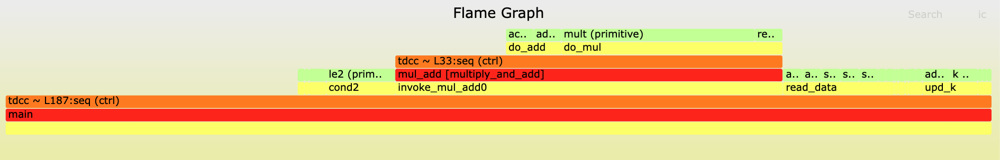
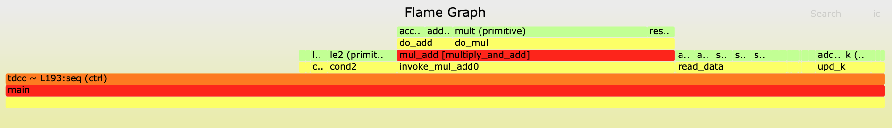

# Petal (Calyx Profiler) Evaluation

This repository contains the evaluation materials for our OOPSLA 2026 paper, "Understanding Accelerator Compilers via Performance Profiling".

The evaluation consists of reproduction of figures and performance claims made in the paper, which introduces Petal, a profiler for The Calyx Infrastructure.

**Goals:** There are four goals for this artifact evaluation:
1. To reproduce claims about Petal's performance.
2. To reproduce the flame graphs, timeline views, and statistics tables generated by Petal in case studies.
3. To reproduce the effects that cycle counts optimizations had resource usage and frequency.
4. To show Petal's robustness.

**NOTE:** Installing and running Vivado may be a lengthy and resource-intensive process (an upwards of 5 hours of install + running time and ~59GB of disk space), so we consider it optional. If a reviewer does not have the time or resources to install/run Vivado, they are free to skip the following sections: "Setting up Vivado", "Kick the tires" > "Vivado kick-the-tires", "Vivado result reproduction". These are marked as optional.

**This README (especially the commands to run) may be easier to view through Github: https://github.com/calyxir/calyx-profiler-eval/**

### List of claims

We list the claims made in the paper and the parts of this artifact that support them.

- In Section 7 of the paper under the paragraph "_Petal Profiling Performance_", we make the following claims about Petal's performance. These claims are supported by the artifact under the "Performance Comparison" section.
  > Most programs had 204–306 profiling probes inserted, except the forward feeding neural network (FFNN) program described in Section 10.1 which had 2830 probes.
  > RTL tracing during simulation adds 1.2 to 3.1x overhead (compared to running a non-RTL tracing simulation) through the five programs.
  > Compared to RTL tracing the original program, RTL tracing the instrumented program adds a negligible overhead for all five programs. For all non-FFNN programs, simulating the instrumented program with RTL tracing took less than 5 seconds, and the FFNN program took slightly over 1 minute.
  > In the FFNN program, trace reconstruction took 36% less time than simulating the original program. For all non-FFNN programs, trace reconstruction had a 2-10x overhead compared to simulating the original program. However, trace reconstruction took less than 15 seconds in all cases.
  > The entire end-to-end profiling process took less than three minutes in all programs.

- In Sections 10 and 11 we make claims about the reduced cycle counts of the programs within each case study. These claims are supported by the artifact under the "Case Study Reproduction" section.

- In Section 10.2.3 of the paper, we claim that both the original and final optimized versions of the packet scheduling queues program had a similar critical path and can meet a frequency of 143 MHz, and that the optimized version has a lower number of LUTs. This claim is supported by the artifact under the "Vivado result reproduction" > "Queues" section.

- In Section 11 of the paper under the "_Solution_" paragraph, we claim that the optimized version of the sandpile program had a larger area and a lower maximum frequency than the original version, but that the end-to-end latency improved. This claim is supported by the artifact under the "Vivado Result Reproduction" > "Sandpile" section.

# Download & Installation

The artifact is available in a Ubuntu 24.04 Virtual Machine packaged as an OVA file, of which a permanent link is available [on Zenodo](https://zenodo.org/records/21501772). We assume that you are using [VirtualBox](https://www.virtualbox.org/); we used VirtualBox version 7.2.4. **The Virtual Machine's platform architecture is x86 and therefore the machine cannot be run on ARM-based Macs.** We also include instructions for building the virtual machine using Vagrant in the `vm` directory.

**The username is `vagrant`, and the password is `vagrant`.**

**NOTE:** Verilator, Vivado, and Petal may be memory intensive, so you may need to increase memory on the Virtual Machine. An internet connection is necessary for Vivado installation, opening Perfetto UI to view timeline views, and reading online documentation on Petal.

### [Optional] Setting up Vivado (Requires ~59GB; Estimated time: 1.5-4 hours)

Our evaluation uses Xilinx's Vivado to generate area and timing estimates. Unfortunately because of licensing restrictions, we cannot distribute the VM with these tools installed. However, the tools are free, so we listed the instructions on downloading them below. Additionally, the web installer for the version of Vivado used in the paper (2020.2) is no longer supported, so we have included instructions for downloading Vivado 2022.2 instead. Therefore, some numbers in the artifact will differ from those in the paper.

0. If you don't have a [Xilinx account](https://www.xilinx.com/registration/create-account.html), create one.
1. Log into the VM (username: `vagrant`, password: `vagrant`).
2. The desktop should contain a file `Xilinx Installer`. Double click this to launch the installer; you may need to click "Make Executable").
3. Ignore the pop-up asking you for a new version by clicking `Continue`.
4. Log in with your Xilinx credentials. Make sure that the "Download and Install now" button is checked.
5. On "Select Product to Install", click "Vivado". Click next.
6. On "Select Edition to Install", click "Vivado ML Standard". Click next.
7. To minimize the amount of necessary disk space, only check the necessary devices/features for our evaluation. The sideways blue key icons next to each box will expand when you click on them. It should say "Disk Space Required: 58.2 GB" on the bottom after checking/unchecking as follows.
   - **Should be checked**:
      - "Design Tools" > "Vivado Design Suite" > "Vivado"
      - "Design Tools" > "Vivado Design Suite" > "Vitis HLS"
      - "Devices" > "Production Devices" > "SoCs" > **"Zynq UltraScale+ MPSoC (limited support)"**
   - **Should be UNchecked**:
      - "Design Tools" > "Vitis Model Composer(Xilinx Toolbox...)"
      - "Design Tools" > "DocNav"
      - "Devices" > "Install Devices for Kria SOMs and Starter Kits"
      - "Devices" > "Production Devices" > "SoCs" > "Zynq-7000 (limited support)"
      - "Devices" > "Production Devices" > "SoCs" > "Zynq UltraScale+ RFSoC (limited support)" (This should be grayed out)
      - "Devices" > "Production Devices" > "7 Series (limited support)" (Unchecking this will uncheck everything within it, which is what we want)
      - "Devices" > "Production Devices" > "UltraScale (limited support)" (Unchecking this will uncheck everything within it)
      - "Devices" > "Production Devices" > "UltraScale+ (limited support)" (Unchecking this will uncheck everything within it)
8. Agree to the licenses, and click Next.
9. **Change the install directory location to `/home/vagrant/Xilinx`**. After clicking Next, you should be asked whether you want to create this directory; click "yes".
10. Click "Install". Installation took us 1.5 hours, but it can take anywhere from 2-4 hours. The machine may periodically go into sleep, so it's important to watch over it.

<details>
<summary><b>Troubleshooting common VM problems:</b></summary>

- If you run out of disk space while installing Vivado tools, you will need to clear space on the host machine. The VM is configured to use a dynamically sized disk.

- When trying to run `vivado -version` after installation, you get the error message `application-specific initialization failed: couldn't load file "librdi_commontasks.so": libtinfo.so.5: cannot open shared object file: No such file or directory`. Try running
```
sudo apt update
sudo apt install libtinfo-dev
sudo ln -s /lib/x86_64-linux-gnu/libtinfo.so.6 /lib/x86_64-linux-gnu/libtinfo.so.5
```
</details>

### Setup instructions once you are in the VM and Vivado is installed.

This should be run at the beginning of every terminal session.

1. Activate the Python virtual environment:
```
eval $( fud2 env activate )
```

2. [Optional] If you have logged out since the last time you've run it, re-run the Vivado set-up script:

```
source /home/vagrant/Xilinx/Vitis_HLS/2022.2/settings64.sh
```

Double check that you can now run Vivado by running `vivado -version`. The output should be:

```
vagrant@vagrant:~$ source /home/vagrant/Xilinx/Vitis_HLS/2022.2/settings64.sh
vagrant@vagrant:~$ vivado -version
Vivado v2022.2 (64-bit)
SW Build 3671981 on Fri Oct 14 04:59:54 MDT 2022
IP Build 3669848 on Fri Oct 14 08:30:02 MDT 2022
Tool Version Limit: 2022.10
Copyright 1986-2022 Xilinx, Inc. All Rights Reserved.
```

3. Setup the Calyx HardFloat primitives library:
```
bash ~/calyx/primitives/float/get_hardfloat.sh
cp ~/calyx/primitives/float.futil ~/.calyx/primitives
```

4. Navigate to the evaluation directory by typing:
```
cd ~/Desktop/calyx-profiler-eval
```

Unless noted otherwise by a `cd ~/calyx` command within the step or an earlier step in the same section, all commands should be run from the evaluation directory.

### Evaluation directory file structure and Petal source code

Descriptions for subdirectories and scripts within this repository are as follows:
- `case-studies`: Contains all of the Calyx/Calyx-Py/Dahlia programs used for case studies and examples in the paper, and the data files necessary for running them.
- `figures`: Contains figures shown in this README.
- `vm`: Contains the Vagrantfile and instructions for generating the VM.
- `xdc-files`: Contains configuration files for Vivado used to identify maximum frequencies.
- `reproduce-performance.sh`: Script to run performance benchmarking in the `Performance comparison` section.
- `run-case-studies.sh`: Script to reproduce case study and example figures in the `Case study reproduction` section.

The Calyx repository is located in `~/calyx`, and the source code for Petal is located in `~/calyx/tools/petal`. While this artifact assumes usage of a VM, instructions to install and set up Petal, Calyx, Dahlia, and fud2 locally can be found at [https://docs.calyxir.org/](https://docs.calyxir.org/).

# Kick the tires

We list instructions for testing basic functionality of Petal and Vivado during the Kick the Tires Phase.

### Petal's basic functionality (Estimated time: < 5 minutes)

1. Run Petal on a Calyx program. This step instruments and compiles the input program, simulates the generated Verilog, and processes the RTL trace into visualizations that we will view in steps 2 and 3. In the terminal:
```
cd ~/calyx
mkdir svgs petal-runs
fud2 tests/correctness/pipelined-mac.futil -o svgs/pipelined-mac.svg --through petal \
     -s sim.data=tests/correctness/pipelined-mac.futil.data --dir petal-runs/pipelined-mac
```

2. View the flame graph(s). A flattened flame graph should be created in `svgs/pipelined-mac.svg`. It should look like the below:


A scaled flame graph should also be created in `petal-runs/pipelined-mac/profiler-out/scaled-flame.svg`:


3. Check the timeline view, which should be in `petal-runs/pipelined-mac/profiler-out/timeline_trace.pftrace`. Navigate to [https://ui.perfetto.dev/](https://ui.perfetto.dev/) in the browser, and then click on `Open trace file` in the left navigation bar. When you open the file, Perfetto should look like this:

")

(NOTE: There may be a small discrepancy on what the main component is named; it could be `toplevel.main`, `TOP.toplevel.main`, or something similar. In this writeup we will use `main`.)

Both the white `main` and `main.mac` tracks on the left under "Default Workspace" are dropdowns, and clicking on them will reveal activity of groups/control within the component. Check that you can navigate the Perfetto view (Press `W` for zooming in, `A` for navigating left, `D` for navigating right, and `S` for zooming out).

### [Optional] Vivado kick-the-tires (Estimated time: <5 minutes)

We will run commands to ensure that Vivado is properly set up.

1. Run synthesis and place-and-route on a Calyx program using Vivado, and obtain a JSON summary of Vivado's resource usage and timing reports.

```
cd ~/calyx
fud2 tests/correctness/pipelined-mac.futil --to json-report \
     --through synth-verilog-to-util-json \ 
     -o pipelined-mac-synth.json --dir vivado-runs/pipelined-mac
```

This will generate a `pipelined-mac-synth.json` file containing a summary of synthesis and post-place-and-route results.
```
vagrant@vagrant:~/calyx$ head pipelined-mac-synth.json
{
  "synth": {
    "summary": {
      "lut": 119,
      "dsp": 3,
      "brams": 0.0,
      "registers": 164,
      "carry8": 6,
      "f7_muxes": 0,
      "f8_muxes": 0,
```

The original reports that was parsed to generate the JSON file is located:
- Post-place-and-route resource usage reports: `vivado-runs/pipelined-mac/out/FutilBuild.runs/impl_1/main_utilization_placed.rpt`
- Post-place-and-route timing reports: `vivado-runs/pipelined-mac/out/FutilBuild.runs/impl_1/main_timing_summary_routed.rpt`
- Synthesis resource usage reports: `vivado-runs/pipelined-mac-synth/out/FutilBuild.runs/synth_1/main_utilization_synth.rpt`.

This evaluation is focused on the post-place-and-route results rather than the synthesis results.

2. Confirm the post-place-and-route resource usage numbers:
```
(venv) vagrant@vagrant:~/calyx$ jq '.impl.summary' pipelined-mac-synth.json
{
  "lut": 119,
  "dsp": 3,
  "brams": 0.0,
  "registers": 164,
  "carry8": 6,
  "f7_muxes": 0,
  "f8_muxes": 0,
  "f9_muxes": 0
}
```

3. Confirm that this program meets the "default" clock period of 7.0, and therefore meets a frequency of 143MHz. Here, the `meet_timing` field will be 1 to indicate that the program met the requested clock period, which is indicated in the `period` field (and its frequency is reflected in the `frequency` field).

```
(venv) vagrant@vagrant:~/calyx$ tail -5 pipelined-mac-synth.json
  "meet_timing": 1,
  "worst_slack": 4.221,
  "period": 7.0,
  "frequency": 142.857
}
```

# Step-by-step guide

- **Performance comparison**: Run experiments to reproduce Petal's performance (briefly described in Section 7).

- **Case study reproduction**: Generate the figures found in the paper by running Petal.

- [Optional] **Vivado result reproduction**: Generate the synthesis results found in the paper.

- **Reproducibility Guidelines**
  - [Optional] **Profiling with Petal**: Obtain profiling figures from an example program and perform an optimization.

# Performance comparison (Estimated time: 5-8 hours)

Here, we will reproduce claims about the performance of Petal given in Section 7 under the paragraph "_Petal profiling performance_".

Run the `reproduce-performance.sh` script from the `calyx-profiler-eval` directory. This script runs performance benchmarks on the original versions of the five programs used in the case studies. The script takes an argument which is the path to the Calyx directory.

```
bash reproduce-performance.sh ~/calyx
```

The script will generate a `performance-data/generated-data` directory, and a CSV with the results will be under `performance-data/generated-data/results.csv`. This should be contrasted with the performance numbers given in Section 7 under the paragraph "_Petal profiling performance_".

We explain each column of the CSV below. All times are in seconds.
- `probe-count`: Number of profiling probes inserted into the program.
- `bl-wo-vcd`: Time to run simulation without tracing on the original program.
- `inst-wo-vcd`: Time to run simulation without tracing on the instrumented program.
- `bl-with-vcd`: Time to run simulation with tracing on the original program.
- `inst-with-vcd`: Time to run simulation with tracing on the instrumented program.
- `trace-reconstruction`: Time to run trace reconstruction.
- `petal-e2e`: End-to-end time to run profiling.
- `oh-vcd`: Overhead of simulation with tracing (`bl-with-vcd / bl-wo-vcd`)
- `oh-inst`: Overhead of instrumentation when tracing (`inst-with-vcd / bl-wo-vcd`)
- `oh-reconstruction`: Overhead of trace reconstruction with respect to non-tracing simulation of the original program (`trace-reconstruction / bl-wo-vcd`)

Our version of the results is available in `case-studies/paper-performance-results.csv` for comparison.

**If you are pressed for time:** you can adjust the number of runs that hyperfine does for each benchmark by adding an optional `RUN_COUNT` command-line option. The default is 30 runs (+ 5 warmup runs which will be always run). For example, with the below command the benchmarks will each be run 15 times:

```
bash reproduce-performance.sh ~/calyx 15
```

# Case Study Reproduction (Estimated running time: 20 minutes; estimated inspection time: 30 minutes)

Run the `run-case-studies.sh` script. This script runs Petal and Verilator in order to reproduce all resulting figures and cycle counts in the paper.

```
bash run-case-studies.sh ~/calyx
```

Logs will be written to the `case-studies/logs` directory, and the script will report if any run failed. On a new run of the script, results from previous files will be removed.

The Foward-feeding Neural Network program (FFNN; from Section 10.1) can be time intensive. If you find it necessary to skip its evaluation, you can pass in an optional argument to disable FFNN Verilator and Petal runs:

```
bash run-case-studies.sh ~/calyx SKIP-FFNN
```

If you run the script with this argument, please skip instructions for verifying Figure 14a, Figure 14b, and the cycle counts for the original and optimized versions of the FFNN program.

## Viewing Results

Results will be written to the `case-studies/results` directory. Each figure and table in the paper will have a counterpart file; for example, Figure 4's flame graph will be generated in `case-studies/results/fig-4.svg`. Additionally, there is a `cycle-counts.csv` file that lists the total cycle counts of every profiled program.

**NOTE:** Line numbers will slightly differ from the corresponding figures in the paper. This is because the figures in the paper are adjusted for code snippet listings within the paper. Additionally, colors in Petal's output could differ from colors used in the paper.

### Flame Graphs

Flame graphs are outputted as `*.svg` files. Use firefox to open a flame graph file. Hovering over boxes in the flame graph will tell you the duration of the cell/control group/group (for Calyx; or block/statement in Dahlia).

ex)
```
firefox case-studies/results/fig-4.svg
```

Flame graph figures in the paper:
- Figure 4
  - Control groups are formatted slightly differently than what is in the paper. For example, `tdcc2 ~ L37:seq (ctrl)` would correspond to `seq @ line 37`. Additionally, `invoke_s10` is a compiler auto-generated group that corresponds to `run_s1`.
- Figure 15
- Figure 21a

### Timeline views

Timeline views are outputted as `*.pftrace` files that can be viewed in [Perfetto UI](https://ui.perfetto.dev/). Navigate to [https://ui.perfetto.dev/](https://ui.perfetto.dev/) in the firefox browser, and then click on `Open trace file` in the left navigation bar.

*Key notes for navigation*
- Each "millisecond" on the Perfetto view represents a cycle.
- Press `W` for zooming in, `A` for navigating left, `D` for navigating right, and `S` for zooming out.
- _Calyx timeline views_: There is a dropdown for each cell in the program. Opening it will display a track for Control Register Updates (if there are any), another dropdown that contains all of the control groups (if the cell contains control groups), and tracks representing each thread in the cell.
- _Dahlia timeline views_: Each code block (`for`, `if`) will have a corresponding dropdown.

Many timeline view figures were based on a "zoomed-in" view. Here is a guide on how to get the picture represented in each figure:
- Figure 5: Open the `main` dropdown and its `Control Groups` dropdown.
- Figure 9d: Open the `main` dropdown.
- Figure 9e: Open the `main` dropdown and its `BL0005: for (let k: ubit<4> = 0..2)` dropdown.
- Figure 10: Open the `main` dropdown and navigate to cycle 14160. Figure 11a shows the contents of the `Control Register Updates` track and the `Thread 000` track between cycles 14160-14173 (inclusive), with simplified names:
  - `upd14` corresponds to `read_A_idx`
  - `let17` corresponds to `read_B_idx`
  - `let18` corresponds to `mult_A_B`
  - `upd15` corresponds to `write`
  - `let19` corresponds to `i_next`
- Figure 12: Open the `main` dropdown, open the `Thread 000` dropdown and navigate to cycle 8180. The view represented in the figure is in cycles 8180-8186 (inclusive). The name mapping is the same as above, but the vertical order of groups `upd14`, `let17`, and `let19` may differ. Note that the paper simplified the detail where `let18` now takes 4 cycles; this is because the multiplication primitive was given the annotation that it _could_ take 4 cycles.
- Figure 13a: Open the `main` dropdown and then the `Thread 000` dropdown. The full timeline view should match the figure (with some slight differences in color).
- Figure 13b: Open the `main` dropdown and then the `Thread 000` dropdown. The full timeline view should match the figure (with some slight differences in color).
- Figure 14a: Open the `main.forward_instance` dropdown and pin the tracks `Control Register Updates`, `Thread 017`, `Thread 018`, and `Thread 019` (a pin icon for a track will appear when the cursor hovers over the white track box). Then, navigate to cycle 1855. The view represented in the figure features cycles 1855-1876 (inclusive).
  - `bb0_72`-`bb0_79` corresponds to `bb_1`-`bb_6`
  - `bb0_80`-`bb0_87` corresponds to `bb_7`-`bb_12`
  - `bb0_88`-`bb0_95` corresponds to `bb_13`-`bb_18`
- Figure 14b: Open the `main.forward_instance` dropdown and pin the tracks `Control Register Updates`, `Thread 017`a, `Thread 018`, and `Thread 019`. Then, navigate to cycle 1849. The view represented in the figure features cycles 1849-1865 (inclusive). The simplified names are the same as for Figure 14a. Note that the paper draft simplified the detail where `bb0_72`/`bb0_80`/`bb0_88` and `bb0_77`/`bb0_85`/`bb0_93` now take 4 cycles; this is because the multiplication primitive was given the annotation that it _could_ take 4 cycles.
- Figure 15b: Open the `main.dataplane.myqueue` dropdown, and navigate to cycle 305. The view shown in the figure can be seen on Threads 001-005 between cycle 305-374 (inclusive).
- Figure 18: No navigation required.
- Figure 19: No navigation required.
- Figure 20: No navigation required.
- Figure 21b: Open the `main` dropdown, the `BL0028: while(spills != 0)` dropdown, the `BL0030: for(let y: ubit<32> = 1..9)` dropdown, and the `BL0031: for(let x: ubit<32> = 1..9)` dropdown. Then, navigate to cycle 1047. The iteration represented in the figure is in cycles 1047-1068 (inclusive).
  - Note: You may observe that there are iterations of the inner for loop that contain an empty gap where no line is active. This empty gap occurs when the guard in the preceding `if` is `false`. Calyx's `static-promotion` compiler pass allocates four cycles for each `if` and its corresponding body, but since the guard did not pass there was no activity on that specific cycle.
d
- Figure 21c: Open the `main` dropdown, the `BL0028: while(spills != 0)` dropdown, the `BL0030: for(let y: ubit<32> = 1..9)` dropdown, and the `BL0031: for(let x: ubit<32> = 1..9)` dropdown. Then, navigate to cycle 993. The iteration represented in the figure is in cycles 993-1008 (inclusive).

### Tables

- Table 1: Open `table1.csv` and check the rows that indicate `bb0_72`-`bb0_79`. 
- Table 2: `table2.csv` should be the same as Table 2 in the paper.

# [Optional] Vivado result reproduction (Estimated time: ~30 minutes)

To reproduce post-place-and-route results, we will run synthesis and implementation on Vivado for the original and (final) optimized versions of the program.

**NOTE:** There will be slight differences between the numbers generated through this evaluation and those in the paper. This is because the evaluation uses Vivado 2022.2, whereas the paper used Vivado 2020.2. This is because the web installer for Vivado 2020.2 is no longer supported. None of these discrepancies should largely affect the claims that we make in the paper.

### Queues (Section 10.2; Estimated time: ~10 min)

We walk through steps to support the claim made in Section 10.2.3 in the paper:
> both the original and final optimized versions of the packet scheduling queues program had a similar critical path and can meet a frequency of 143 MHz and the optimized version has a lower number of LUTs.

(1) Generate a JSON Vivado summary of the original program:

```
cd ~/Desktop/calyx-profiler-eval
fud2 case-studies/sec-10/queues-original.futil --to json-report \
     --through synth-verilog-to-util-json \
     -o synth-results/queues-original-synth.json --dir vivado-runs/queues-original
```

(2) Generate a JSON Vivado summary of the optimized program:

```
cd ~/Desktop/calyx-profiler-eval
fud2 case-studies/sec-10/queues-full-opt.futil --to json-report \
     --through synth-verilog-to-util-json \
     -o synth-results/queues-full-opt-synth.json --dir vivado-runs/queues-full-opt-synth
```

(3) Check that post-place-and-route ("impl"), the number of LUTs of the optimized program is _lower_ than the number of LUTs in the original program.

```
(venv) vagrant@vagrant:~/Desktop/calyx-profiler-eval$ jq '.impl.summary.lut' synth-results/queues-original-synth.json
1223
(venv) vagrant@vagrant:~/Desktop/calyx-profiler-eval$ jq '.impl.summary.lut' synth-results/queues-full-opt-synth.json
883
```

(4) Check that both programs meet the clock period of 7.0, and therefore can meet a frequency of 143 MHz.

```
(venv) vagrant@vagrant:~/Desktop/calyx-profiler-eval$ tail -5 synth-results/queues-original-synth.json
  "meet_timing": 1,
  "worst_slack": 2.755,
  "period": 7.0,
  "frequency": 142.857
}
(venv) vagrant@vagrant:~/Desktop/calyx-profiler-eval$ tail -5 synth-results/queues-full-opt-synth.json
  "meet_timing": 1,
  "worst_slack": 2.339,
  "period": 7.0,
  "frequency": 142.857
}
```

### Sandpile (Section 11; Estimated time: 20 min)

We walk through steps to support the claim made in Section 11 of the paper under the "_Solution_" paragraph:
> the optimized version of the sandpile program had a larger area and a lower maximum frequency than the original version, but that the end-to-end latency improved.

1. Identify the maximum frequency and end-to-end latency of the original program. (~10 minutes)

First, we will _attempt_ to meet a clock period of 3.88. The `xdc-files` directory contains configuration files for target clock frequencies.

```
cd ~/Desktop/calyx-profiler-eval
fud2 case-studies/sec-11/sandpile-original.fuse --to json-report \
     --through synth-verilog-to-util-json \
     -o synth-results/sandpile-original-3-88.json --dir vivado-runs/sandpile-original-3-88 -s synth-verilog.constraints=`pwd`/xdc-files/3-88.xdc
```

Then, we will find that place-and-route cannot meet that frequency by checking the `meet_timing` field (the output could also be null):
```
(venv) vagrant@vagrant:~/Desktop/calyx-profiler-eval$ jq '.meet_timing' synth-results/sandpile-original-3-88.json
0
```

Next, we will attempt to meet a clock period of 3.89.

```
fud2 case-studies/sec-11/sandpile-original.fuse --to json-report \
     --through synth-verilog-to-util-json \
     -o synth-results/sandpile-original-3-89.json --dir vivado-runs/sandpile-original-3-89 -s synth-verilog.constraints=`pwd`/xdc-files/3-89.xdc
```

Then, we will find that place-and-route can meet that frequency:
```
(venv) vagrant@vagrant:~/Desktop/calyx-profiler-eval$ jq '.meet_timing' synth-results/sandpile-original-3-89.json
1
```

We can double check the frequency of this clock period, and calculate the end-to-end latency:
```
(venv) vagrant@vagrant:~/Desktop/calyx-profiler-eval$ jq '.frequency' synth-results/sandpile-original-3-89.json
257.069
(venv) vagrant@vagrant:~/Desktop/calyx-profiler-eval$ echo "3.89 * 45536" | bc -l
177135.04
```

2. Identify the maximum frequency and end-to-end latency of the optimized program. (~10 minutes)

First, we will _attempt_ to meet a clock period of 4.63. The `xdc-files` directory contains configuration files for target clock frequencies.

```
cd ~/Desktop/calyx-profiler-eval
fud2 case-studies/sec-11/sandpile-optimized.fuse --to json-report \
     --through synth-verilog-to-util-json \
     -o synth-results/sandpile-optimized-4-63.json --dir vivado-runs/sandpile-optimized-4-63 -s synth-verilog.constraints=`pwd`/xdc-files/4-63.xdc
```

Then, we will find that place-and-route cannot meet that frequency by checking the `meet_timing` field  (the output could also be null):
```
(venv) vagrant@vagrant:~/Desktop/calyx-profiler-eval$ jq '.meet_timing' synth-results/sandpile-optimized-4-63.json
0
```

Next, we will attempt to meet a clock period of 4.64.

```
fud2 case-studies/sec-11/sandpile-optimized.fuse --to json-report \
     --through synth-verilog-to-util-json -o synth-results/sandpile-optimized-4-64.json \
     --dir vivado-runs/sandpile-optimized-4-64 -s synth-verilog.constraints=`pwd`/xdc-files/4-64.xdc
```

Then, we will find that place-and-route can meet that frequency:
```
7(venv) vagrant@vagrant:~/Desktop/calyx-profiler-eval$ jq '.meet_timing' synth-results/sandpile-optimized-4-64.json
1
```

We can double check the frequency and calculate the end-to-end latency:
```
(venv) vagrant@vagrant:~/Desktop/calyx-profiler-eval$ jq '.frequency' synth-results/sandpile-optimized-4-64.json
215.517
(venv) vagrant@vagrant:~/Desktop/calyx-profiler-eval$ echo "4.64 * 33632" | bc -l
156052.48
```


3. Compare the resource usage numbers (<1 min)

Now, we can compare the number of LUTs from the reports with the maximum frequency for both programs:
```
(venv) vagrant@vagrant:~/Desktop/calyx-profiler-eval$ jq '.impl.summary.lut' synth-results/sandpile-original-3-89.json
779
(venv) vagrant@vagrant:~/Desktop/calyx-profiler-eval$ jq '.impl.summary.lut' synth-results/sandpile-optimized-4-64.json
991
```

# Reusability Guidelines

Our compiler driver tool fud2 orchestrates commands necessary to compile to/from Calyx, run simulation, Petal, synthesis, and more. The bulk of all scripts in this artifact are runs of fud2 commands. Documentation on fud2 is here: https://docs.calyxir.org/running-calyx/fud2/index.html. 

External documentation on running Petal via fud2 is also available: https://docs.calyxir.org/running-calyx/profiler.html . In general, one can run Petal using fud2 with the following command structure:
```
fud2 <CALYX_FILE> -o <FLAT_FLAME_NAME>.svg --through petal -s sim.data=<DATA_FILE> --dir <OUT_DIR>
```
where
- `CALYX_FILE` is the input Calyx file
- `FLAT_FLAME_NAME` is the name of the output flattened flame graph. It is important that this file ends with the extension `.svg`.
- `DATA_FILE` supplies the memory data to the Calyx file
- `OUT_DIR/profiler-out` will be the location where fud2 will write intermediate and additional outputs. In particular, `OUT_DIR/profiler-out/scaled-flame.svg` will contain the scaled flame graph, and `OUT_DIR/profiler-out/timeline_trace.pftrace` will contain an input protobuf file for Perfetto to load the timeline view.

## [Optional] Profiling with Petal

In this section, we will walk through an example of how to use Petal to observe the performance impact of changes to programs. This optional experiment is an open-ended guide to show that Petal is **reusable** to find optimization opportunities in Calyx code.

0. Choose a starting program (in Calyx/Dahlia/Calyx-Py) to optimize. In our example, we will use a Calyx matrix multiplication program, which can be found at `~/calyx/tests/firrtl/matrix_multiply.futil`.

1. Run Petal on the original program. Our example code is written in Calyx so we will use the `--through petal` flag to run only Calyx-level profiling. For Dahlia programs, one should use the `--through petal-dahlia` flag to run Dahlia and Calyx-level profiling, and for Calyx-Py, one should use the `--through petal-calyx-py` flag to run Calyx-Py and Calyx-level profiling.

ex)
```
cd ~/calyx
mkdir -p svgs petal-runs
fud2 tests/firrtl/matrix_multiply.futil -o svgs/matrix_multiply.svg --through petal \
     -s sim.data=tests/firrtl/matrix_multiply.futil.data --dir petal-runs/matrix_multiply
```

2. Once the command terminates, a `profiler-out` subdirectory should be created under the path passed under the `--dir` flag in the previous command. Open the scaled flame graph in a browser to observe the duration of various routines in the program.

ex)
```
firefox petal-runs/matrix_multiply/profiler-out/scaled-flame.svg
```
will show:


Hovering over the `main` box will tell us that the whole program took 1141 cycles. Through the flame graph, we also notice that there are two component cells (`main` and `mul_add [multiply_and_add]`) with noticeable control overhead such as the length of the blank space above the `tdcc ~ L33:seq (ctrl)` box (to the left of the yellow `do_add` box). This overhead comes from registers that manage control within the component.

Additionally, you can display the timeline view by going to [https://ui.perfetto.dev/](https://ui.perfetto.dev/) in the browser and opening `timeline_trace.pftrace` (In our example, the full path would be `petal-runs/matrix_multiply/profiler-out/timeline_trace.pftrace`).

3. Modify the program. In our example, we will make a simple optimization to remove the control overhead in the `mul_add [multiply_and_add]` cell (the blank space mentioned in Step 2). To do so, we will add annotations hinting to the Calyx compiler that the groups in the `multiply_and_add` component will always take a fixed number of cycles and therefore control registers (and any control groups) are not necessary. (We can use `group-stats.csv` to first get the sense that the two groups consistently take the same amount of cycles respectively, and then reason through the source code that they actually would always take a fixed number of cycles.)

If you are following our example, make the following modifications to `~/calyx/tests/firrtl/matrix_multiply.futil`:

3.1. On line 14, add a `<"promotable"=4>` annotation to the group `do_mul`.

```
-    group do_mul {
+    group do_mul<"promotable"=4> {
```

3.2. On line 23, add a `<"promotable"=1>` annotation to the group `do_add`.
```
-    group do_add {
+    group do_add<"promotable"=1> {
```

4. Run Petal on the program again. Note that the below command chooses a different path for the `--dir` flag to preserve profiling results of the original version of the program, but this is not necessary.

ex)
```
fud2 tests/firrtl/matrix_multiply.futil -o svgs/matrix_multiply_opt.svg --through petal \
     -s sim.data=tests/firrtl/matrix_multiply.futil.data --dir petal-runs/matrix_multiply_opt
```

5. Observe the changes in the produced flame graph (and timeline view).

ex)
```
firefox petal-runs/matrix_multiply_opt/profiler-out/scaled-flame.svg
```
will show:


Hovering over the `main` box shows that the total number of cycles is now 1013, meaning our small optimization removed 101 cycles from the original program. We can also notice that the control group in `mul_add` (the orange `tdcc ~ L33:seq (ctrl)` in the original program) no longer exists because the groups in `multiply_and_add` only need static control. Another indication that we removed all control register overhead in the `multiply_and_add` component is that the length of the `mul_add [multiply_and_add]` box is equal to the added length of the `do_add` and `do_mul` boxes, which means that all of those cycles were spent on meaningful computation.

Congratulations! You've successfully optimized a Calyx program using performance information obtained by Petal.